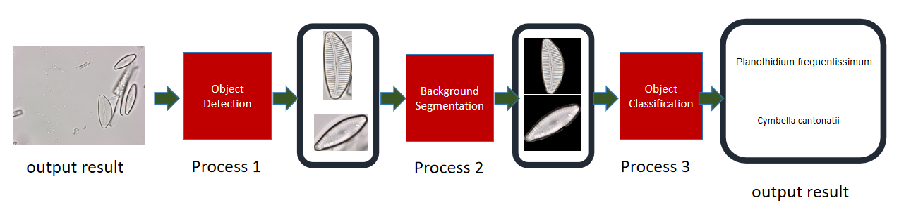
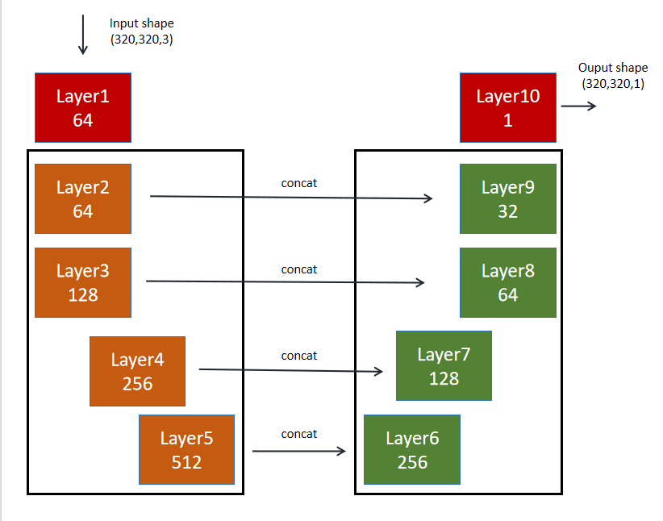
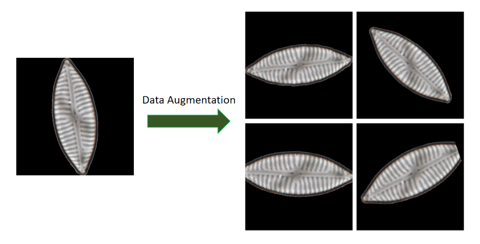
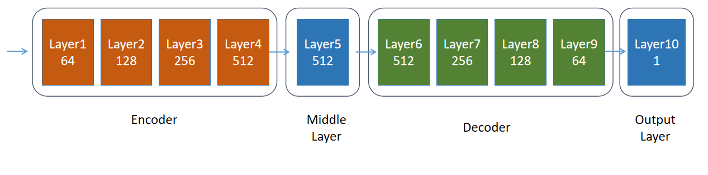

# OM-Diatom-Classification-Yolo-MobileNet
## Architecture：YOLO + U-Net + MobileNetV2
* pipeline
* 
### YOLO: dectect where the object is.
* get individual diatom
* 
### U-Net: segment from background.
* model architecture
* 
* segment and data augmentation
* 
### MobileNetV2: classify them.
* model architecture
* 
* 
## Showcase 
* I used 3 models for the task and finally it works better than yolo only in my dataset.
* 

