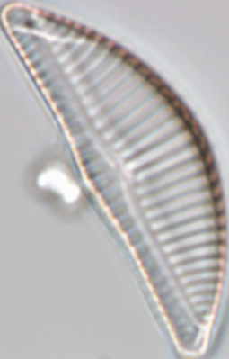
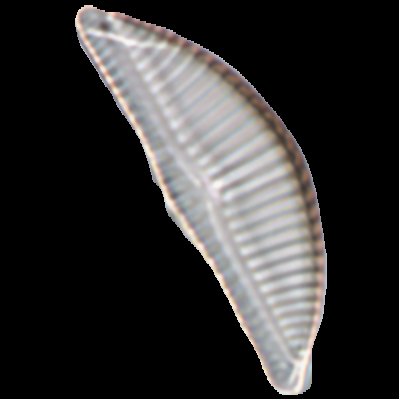
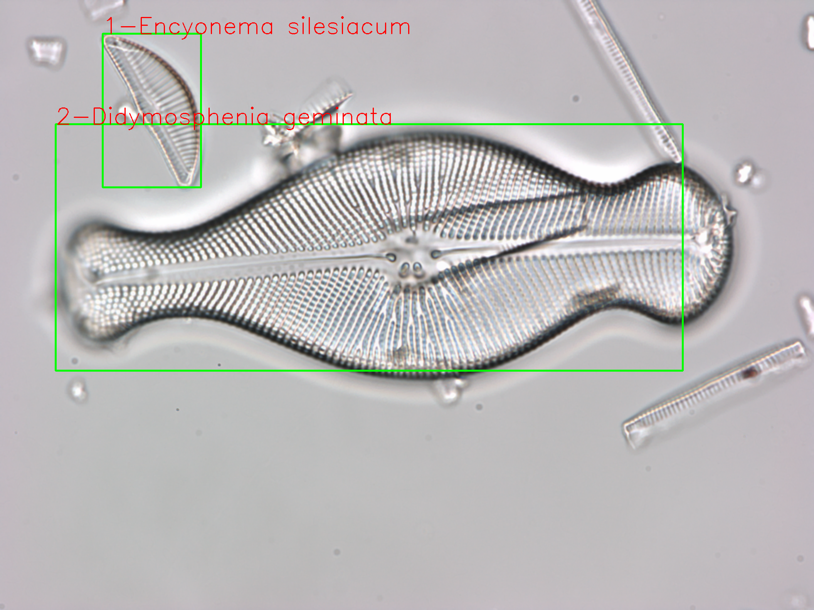
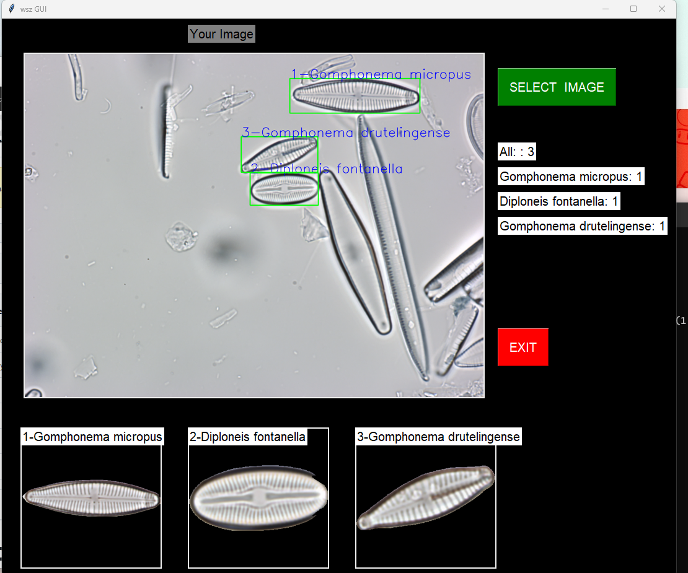

# OM-Diatom-Classification-Yolo-MobileNet
# Architecture
* YOLO + U-Net + MobileNetV2
* YOLO: dectect where the object is.
* 
* FCN: segment from background.
* 
* MobileNetV2: classify them.
* 
# showcase 
* I used 3 models for the task and finally it works better than yolo in my dataset.
* 

